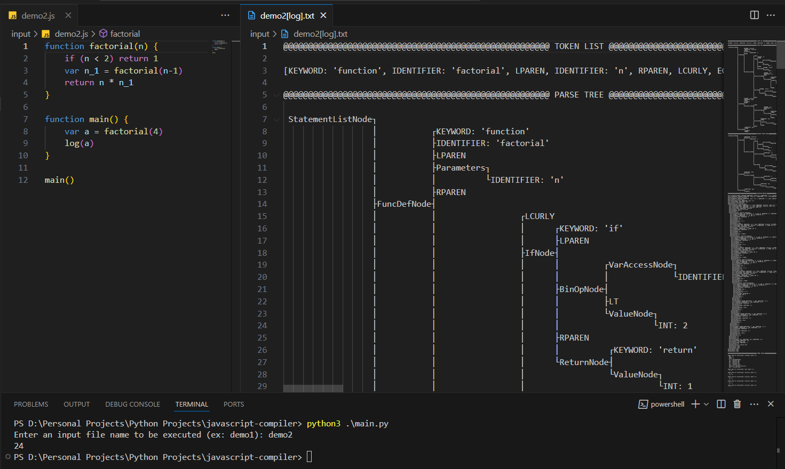

JavaScript Compiler Simulator
=============================

This project is a Python-based simulator for a JavaScript compiler pipeline. It includes core stages such as lexical analysis, parsing, and interpretation, and provides sample JavaScript inputs for testing.



Getting Started
---------------

Run the project from the command line to keep the console window open and view full output:

```bash
python main.py
```

Project Layout
--------------

- `main.py`: Entry point for running the simulator.
- `src/`: Core compiler components (lexer, parser, interpreter, AST, and supporting modules).
- `input/`: Sample JavaScript test files.
- `input/*[log].txt`: Output logs corresponding to sample inputs.

Notes
-----

- Use files in the `input/` directory to test different scenarios.
- Ensure Python is installed and available in your system `PATH`.
